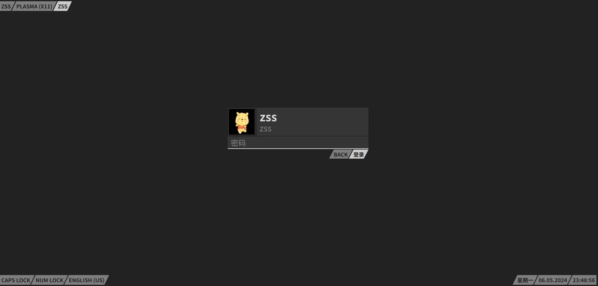
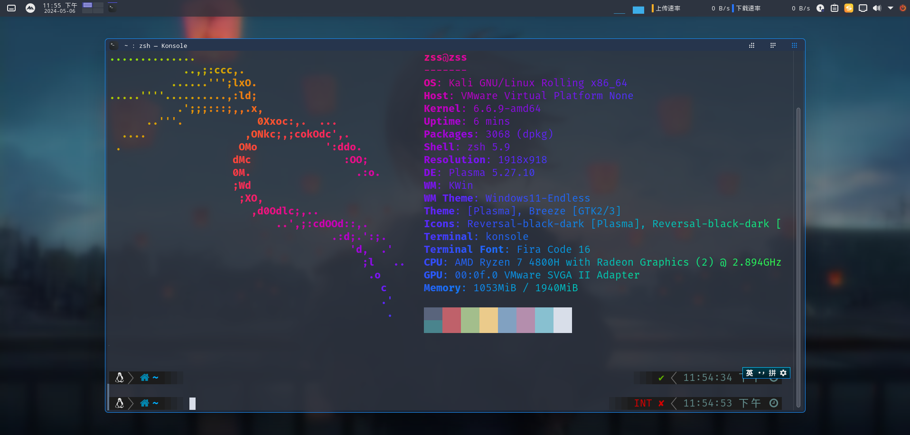
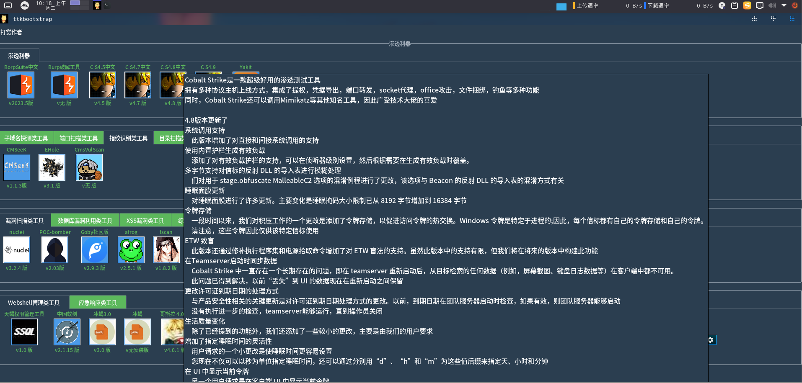
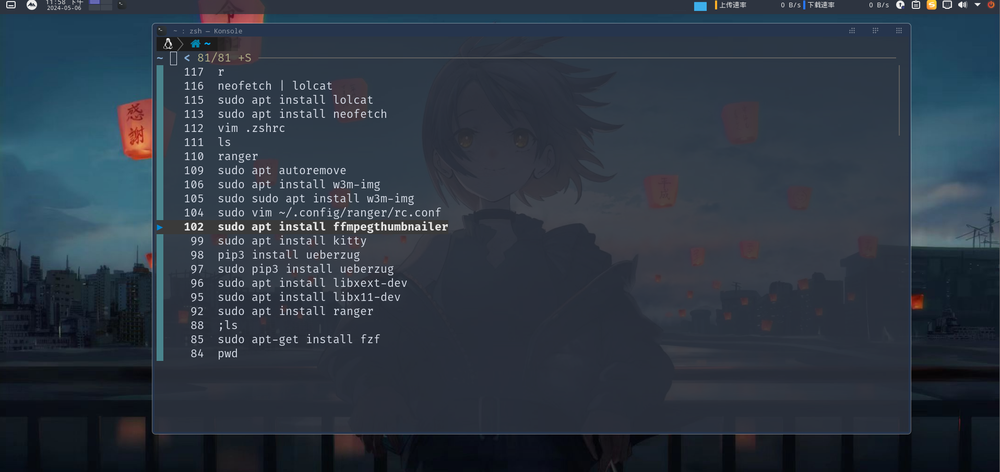
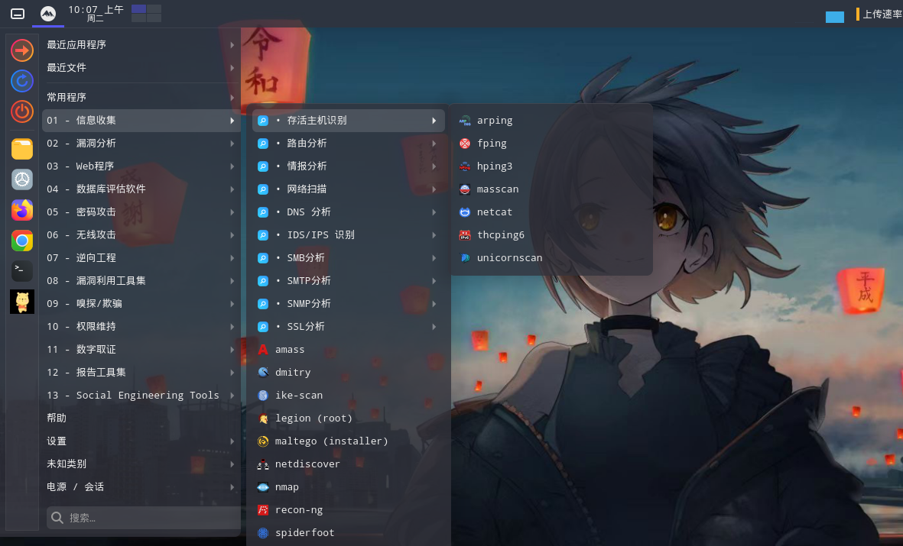
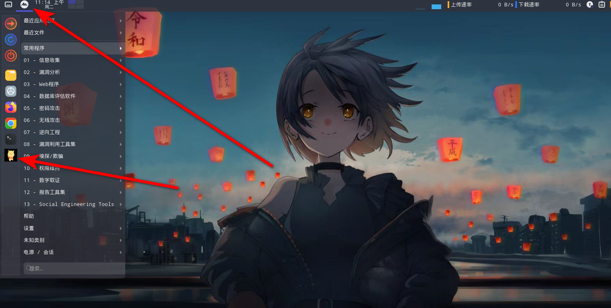
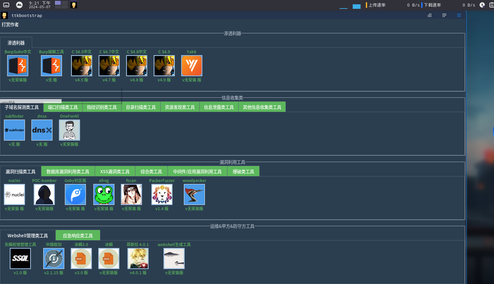
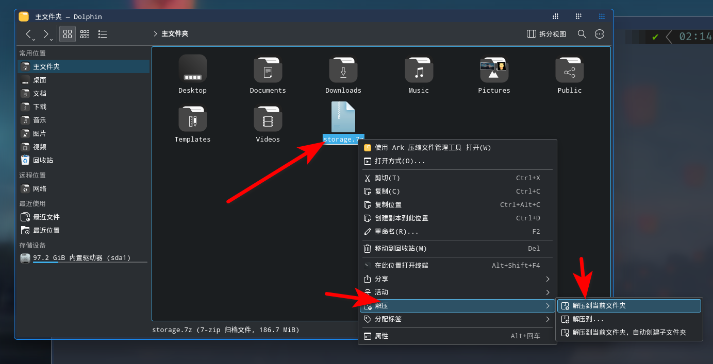
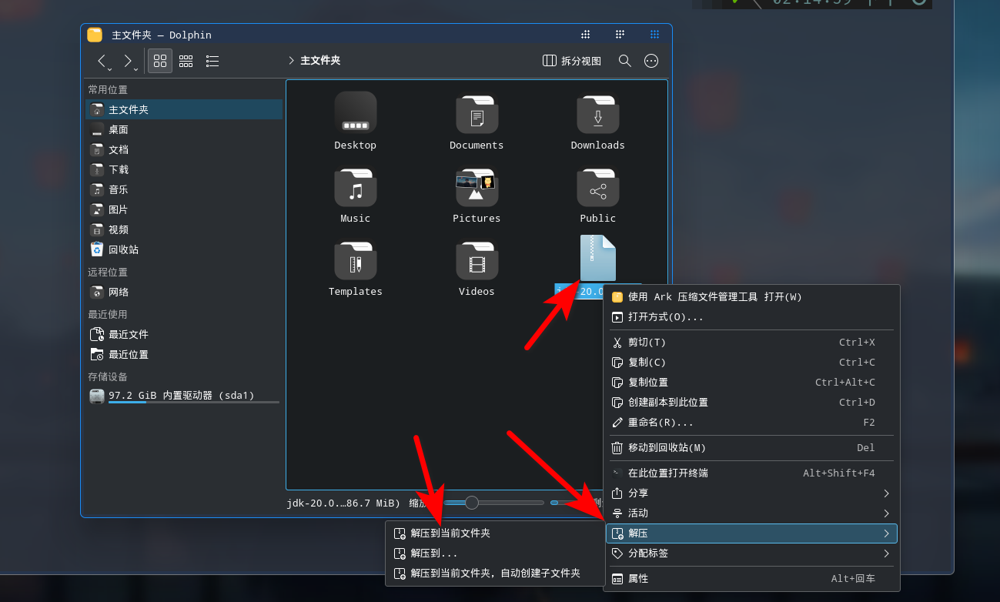

 > 系统版本：kali linux 2024.1

> 固件类型：BIOS

> 用户: zss 密码: ss

## 完整版

>系统压缩大小：18.8 GB
>
>解出来：36.00GB 左右
>
>完整版大小18.8 GB  下载地址：https://pan.quark.cn/s/3ba90a47b705 提取码：drcU 

## 系统版

> 系统压缩大小：4.91 GB
>
> 解出来：20.00GB 左右
>
> 系统版大小4.91 GB 下载地址：https://pan.quark.cn/s/020a81c976f1  提取码：Sdzr

## 前言

在很早之前就听kali linux鼎鼎大名的黑客系统集成了600多种黑客工具，黑客榜首系统，然后在高中就逼迫自己使用kali linux系统作为自己物理的主力系统使用，哎呀！主要还是逼迫自己学习linux

然后接触arch中间使用一段时间，最后又换回来 kali 系统，很多人说arch系统是比kali 或者Ubuntu好用，怎么说呢各有优缺点吧，arch个人定制化很强什么都要自己安装，搜索linux相关问题基本上都是arch的文档

kali linux从使用方面基本上和Ubuntu是没有区别的都是基于Debian系统
kali linux之前叫Backtrack都是Offensive Security（OffSec）开发的，Offensive Security是全球非常有名的一家美国的安全公司

- 在23年推出了kali的i3魔改，i3环境linux小白真的不容易上手，他占用的资源很少

- 我在22年的时候在《DRT安全团队》发布过kali的kde环境的美化，和这个美化是一样的，但是里面的美化是对照我的物理机进行美化，导致在虚拟机里面运行很卡消耗系统资源，在物理机占用大点资源无所谓，在虚拟机里面占用资源大就会很卡。

## 优化

这个美化是按照虚拟机性能美化的，在这个版本叫没有用的美化，和消耗资源的美化给取消了

1. 系统的内存优化
2. 硬盘优化
3. 界面优化
4. vm虚拟机和kde复制问题解决优化

## 魔改后的效果

## 这个版本添加工具

武器库

在这个版本里面我添加了自用的写的工具箱，一共集成了常见测试工具近60个，在kali 系统上没有的
导入什么工具就可以用什么工具

- 运行环境
  - **java 8**：下载地址链接：https://pan.quark.cn/s/e7e431924e27 提取码：hpmT
  - **java 20**：下载地址链接：https://pan.quark.cn/s/a18dc13ac47c 提取码：Kz6v
- 神兵利器
  - **BurpSuite pro中文版**：下载地址链接：https://pan.quark.cn/s/b40e1abed7a8 提取码：pEnL
  - **BurpSuite破解工具**：下载地址链接：https://pan.quark.cn/s/bdd971e12e29 提取码：VFw2
  - **Cobalt Strike 4.5**：下载地址链接：https://pan.quark.cn/s/f862f54e27f6 提取码：aRSX
  - **Cobalt Strike 4.7**：下载地址链接：https://pan.quark.cn/s/d100fe80ff64 提取码：uyGh
  - **Cobalt Strike 4.8**：下载地址链接：https://pan.quark.cn/s/d31b547e6aeb 提取码：fhQE
  - **Cobalt Strike 4.9**：下载地址链接：https://pan.quark.cn/s/bc748c814391 提取码：RM58
  - **Yakit**：下载地址链接：https://pan.quark.cn/s/0d75f5516906 提取码：AC1R
- 端口扫描工具
  - **naabu**：下载地址链接：https://pan.quark.cn/s/98d83681e152 提取码：ATXW
- 指纹识别工具
  - **CMSeek**： 下载地址链接：https://pan.quark.cn/s/f44df7a0319e 提取码：Puez
  - **EHole**：下载地址链接：https://pan.quark.cn/s/f4c734f50670 提取码：SAdJ
  - **CmsVulScan**：下载地址链接：https://pan.quark.cn/s/1033b135e01c 提取码：TYH9
- 目录扫描工具
  - **dirsearch**：下载地址链接：https://pan.quark.cn/s/2ba4caf0c70b 提取码：nMSm
- 资源发现工具
  - **Fofa_Viewer**：下载地址链接：https://pan.quark.cn/s/962fdf66cfa9 提取码：xpTW
  - **Fofax**：下载地址链接：https://pan.quark.cn/s/ee5b5ad547df 提取码：vg3V
- 信息泄露工具
  - **Cloud_Bucket_Leak_Detection_Tools**（云存储泄露工具）：下载地址链接：https://pan.quark.cn/s/e94aada8a796 提取码：um5p
  - **SvnExploit**：下载地址链接：https://pan.quark.cn/s/0ec59c2da3cb 提取码：2dKe
  - **Dumpall**：下载地址链接：https://pan.quark.cn/s/0335ec8b5f55 提取码：89uH
- 子域名探测工具
  - **dnsx**：无需下载
  - **OneForAll**：下载地址链接：https://pan.quark.cn/s/89f44abfa6ef 提取码：u9a1
  - **密探**：下载地址链接：https://pan.quark.cn/s/be85bf484938 提取码：nR2E
  - **OneLong**：下载地址链接：https://pan.quark.cn/s/f195448d3018 提取码：Pygg
  - **subfinder**：无需下载
- 其他信息收集工具
  - **zpscan**：下载地址链接：https://pan.quark.cn/s/3baccd78f8d9 提取码：tD8k
- 漏洞扫描工具
  - **nuclei**：下载地址链接：https://pan.quark.cn/s/86783ebb9950 提取码：JSeJ
  - **POC-bomber**：下载地址链接：https://pan.quark.cn/s/f7b762dbc489 提取码：35XE
  - **Goby**：下载地址链接：https://pan.quark.cn/s/ced80604ca66 提取码：n3dy
  - **afrog**：下载地址链接：https://pan.quark.cn/s/08dd6cfc6a13 提取码：WDeb
  - **fscan**：下载地址链接：https://pan.quark.cn/s/9d647a538133 提取码：mjd8
  - **Packer-Fuzzer**：下载地址链接：https://pan.quark.cn/s/6cbe3fd02fa9 提取码：XREM
  - **woodpecker-framework**：下载地址链接：https://pan.quark.cn/s/cc77ad0b98dc 提取码：KejX
- 数据库漏洞利用工具
  - **Sqlmap中文版**：下载地址链接：https://pan.quark.cn/s/db62401aaf93 提取码：XShD
  - **MDUT**：下载地址链接：https://pan.quark.cn/s/69d05daf3946 提取码：LN9f
  - **ARDM**：下载地址链接：https://pan.quark.cn/s/151db6b3462c 提取码：m766
- XSS漏洞工具
  - **XSS-Trike**：下载地址链接：https://pan.quark.cn/s/aedafe0ebd3d 提取码：vnAd
  - **DalFox**：下载地址链接：https://pan.quark.cn/s/6be81e766fbe 提取码：HJ8p
- 综合工具
  - **Yasso**：下载地址链接：https://pan.quark.cn/s/82f8c4cee5fe 提取码：QYGT
  - **LiqunKit**：下载地址链接：https://pan.quark.cn/s/ca8604ad15b4 提取码：eXkV
  - **Full-Scanner**：下载地址链接：https://pan.quark.cn/s/be259959a219 提取码：TV4K
- 中间件/应用漏洞工具
  - **FastjsonScan**：下载地址链接：https://pan.quark.cn/s/9a86ce449af1 提取码：AR1U
  - **WeblogicTool**：下载地址链接：https://pan.quark.cn/s/5a04e4b59252 提取码：cH67
  - **Struts2漏洞检查工具**：下载地址链接：https://pan.quark.cn/s/ecc0694750a2 提取码：5c24
  - **ShiroAttack2**：下载地址链接：https://pan.quark.cn/s/4d7be6e8e441 提取码：czEK
  - **ShiroExp**：下载地址链接：https://pan.quark.cn/s/f2c46eed3cda 提取码：FKRR
  - **MYExploit**：下载地址链接：https://pan.quark.cn/s/71cc533b3fa3 提取码：Taw9
  - **OA-EXPTOOL**：下载地址链接：https://pan.quark.cn/s/42f8af0b802c 提取码：vWaJ
  - **通达OA漏洞利用工具**（TongdaOATools）下载地址链接：https://pan.quark.cn/s/783bea9d84e0 提取码：5rrs
  - **Apt-t00ls**：下载地址链接：https://pan.quark.cn/s/976d2ddee8e0 提取码：EFqz
  - **综合利用工具**：下载地址链接：https://pan.quark.cn/s/653f070d24c2 提取码：kebv
  - **利用工具By莲花**：下载地址链接：https://pan.quark.cn/s/888313af6e89 提取码：7uxC
  - **Jboss漏洞工具**：下载地址链接：https://pan.quark.cn/s/550c559ed412 提取码：aKTX
  - **SBSCAN**：下载地址链接：https://pan.quark.cn/s/c80ca3f82f5d 提取码：35XE
- 暴力破解工具
  - **社工密码生成器**：下载地址链接：https://pan.quark.cn/s/b7146f624697 提取码：DvW3
  - **pydictor**：下载地址链接：https://pan.quark.cn/s/d03ff4678098 提取码：8594
- webshell管理类工具
  - **天蝎权限管理工具**（skyscorpion）下载地址链接：https://pan.quark.cn/s/660afbc67e2e 提取码：mMss
  - **中国蚁剑**：下载地址链接：https://pan.quark.cn/s/7b7d61c4eaaf 提取码：7n84
  - **冰蝎3.0**：下载地址链接：https://pan.quark.cn/s/c5b1ba5813c1 提取码：jbPe
  - **冰蝎**：下载地址链接：https://pan.quark.cn/s/20e3fd70b5e1 提取码：ZHwK
  - **哥斯拉 4.0.1**：下载地址链接：https://pan.quark.cn/s/8492d9429bda 提取码：mQDW
  - **webshell生成工具**（webshell_generate）下载地址链接：https://pan.quark.cn/s/06d9858824f6 提取码：2NDy

## 系统已经安装

- 搜狗输入法
- 谷歌浏览器
- 火狐浏览器
  - • HTTP Header Live：是一款可以帮助用户查看当前使用Chrome打开的所有网页的状态
  - • FoxyProxy：用的切换代理工具
  - • Video DownloadHelper ：提取网页视频
  - • Disable javascript 禁止js

- neofetch
- lolcat
- 文泉驿-微米黑
- 文泉驿-正黑
- 文泉驿-点阵宋体
- 图标：Qigir-ubuntu-darkReversal 小米
- Plasma样式：Layn
- 光标：Layan
- 安装登录管理器：sddm
- 欢迎界面：AnimatedAbstract_bku9
- 登录屏幕：Slice
- utools（已经安装没有启动，会影响虚拟机性能）
- latte-dock（已经安装没有启动，会影响虚拟机性能）
- fzf
- ranger
- subfinder
- dnsx

## 增加好用功能

我这个基于工具写了一些好用功能

### 终端搜索功能

这个是基于fzf工具

比如我们在终端搜索之前用过的命令

我们按`ctrl+r` 搜索历史命令

比如我们pip命令后面忘了是什么了，我们就可以输入pip然后在按`ctrl+r`

### 终端文件管理器

这个功能是ranger工具

在终端输入r

## 下载使用说明

关注“W啥都学“公众号回复kde2获取下载链接

我一共打包了2个版本

### 完整版

>系统压缩大小：18.8 GB
>
>解出来：36.00GB 左右

这个版本是叫全部工具集成上去了，优点打开即可使用，缺点下载文件会很大

### 系统版

> 系统压缩大小：4.91 GB
>
> 解出来：20.00GB 左右

这个版本没有叫工具放上去，安装了工具框架，优点下载文件小，缺点需要自己下载导入工具

下载导入方法

1. 全部工具导入

   全部工具导入，下载文件名叫`storage.7z`，然后放到用户目录（/home/zss）下面解压即可图

   `storage.7z`大概3GB左右

   

   导入完成，全部功能都可以使用了

2. 单个工具导入

   单个工具导入，下载自己想用的工具导入，比如下载`jdk-20.0.1.zip`，然后放到用户目录（`/home/zss`）下面解压即可图

   注意：java环境启动的要先下载解压java 20和java 8

   > java 20 下载地址：https://pan.quark.cn/s/4c2708e908ac 提取码：ms3Y，
   > java 8 下载地址：https://pan.quark.cn/s/e7e431924e27 提取码：hpmT

   

   导入什么工具就可以用什么工具
