 > 系统版本：kali linux 2024.1

> 固件类型：BIOS

> 用户: zss 密码: ss

## 完整版

>系统压缩大小：18.8 GB
>
>解出来：36.00GB 左右
>
>完整版大小18.8 GB  下载地址：https://pan.quark.cn/s/3ba90a47b705 提取码：drcU 

## 系统版

> 系统压缩大小：4.91 GB
>
> 解出来：20.00GB 左右
>
> 系统版大小4.91 GB 下载地址：https://pan.quark.cn/s/020a81c976f1  提取码：Sdzr

## 前言

在很早之前就听kali linux鼎鼎大名的黑客系统集成了600多种黑客工具，黑客榜首系统，然后在高中就逼迫自己使用kali linux系统作为自己物理的主力系统使用，哎呀！主要还是逼迫自己学习linux

然后接触arch中间使用一段时间，最后又换回来 kali 系统，很多人说arch系统是比kali 或者Ubuntu好用，怎么说呢各有优缺点吧，arch个人定制化很强什么都要自己安装，搜索linux相关问题基本上都是arch的文档

kali linux从使用方面基本上和Ubuntu是没有区别的都是基于Debian系统
kali linux之前叫Backtrack都是Offensive Security（OffSec）开发的，Offensive Security是全球非常有名的一家美国的安全公司

- 在23年推出了kali的i3魔改，i3环境linux小白真的不容易上手，他占用的资源很少

- 我在22年的时候在《DRT安全团队》发布过kali的kde环境的美化，和这个美化是一样的，但是里面的美化是对照我的物理机进行美化，导致在虚拟机里面运行很卡消耗系统资源，在物理机占用大点资源无所谓，在虚拟机里面占用资源大就会很卡。

## 优化

这个美化是按照虚拟机性能美化的，在这个版本叫没有用的美化，和消耗资源的美化给取消了

1. 系统的内存优化
2. 硬盘优化
3. 界面优化
4. vm虚拟机和kde复制问题解决优化

## 魔改后的效果

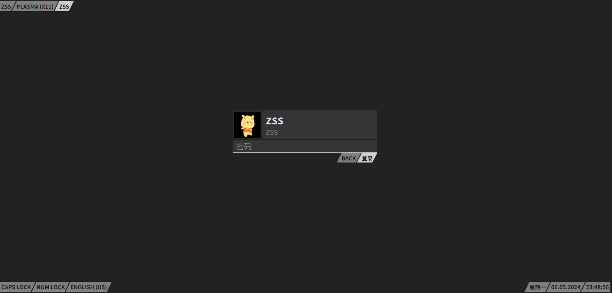

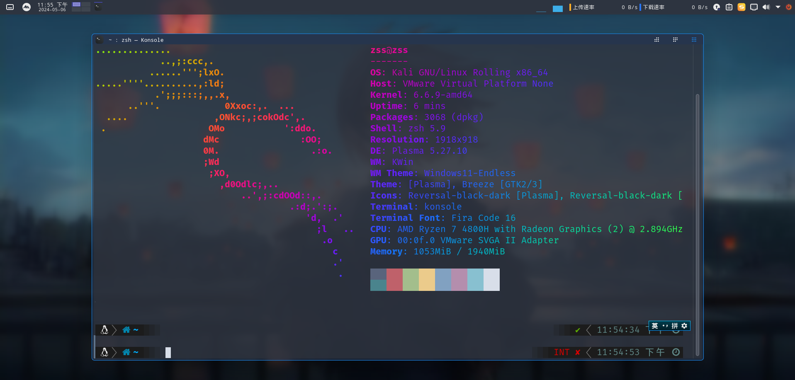

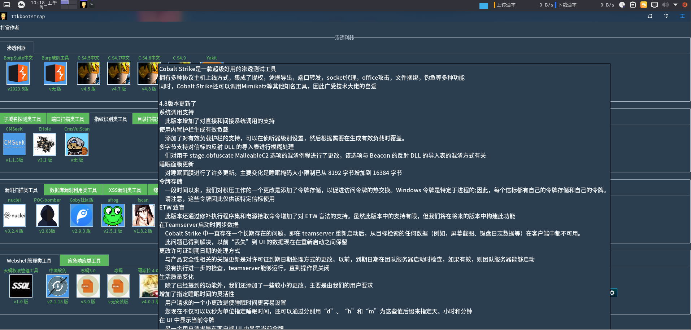

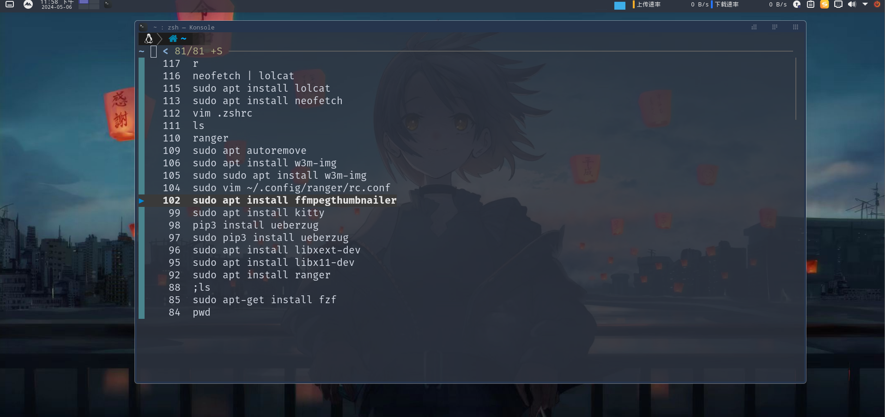

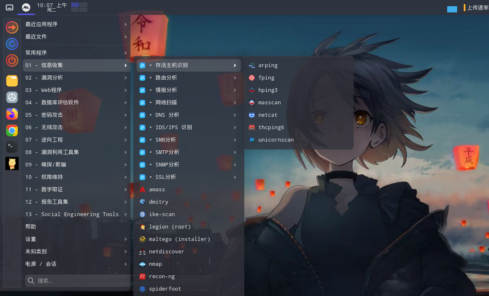

## 这个版本添加工具

武器库

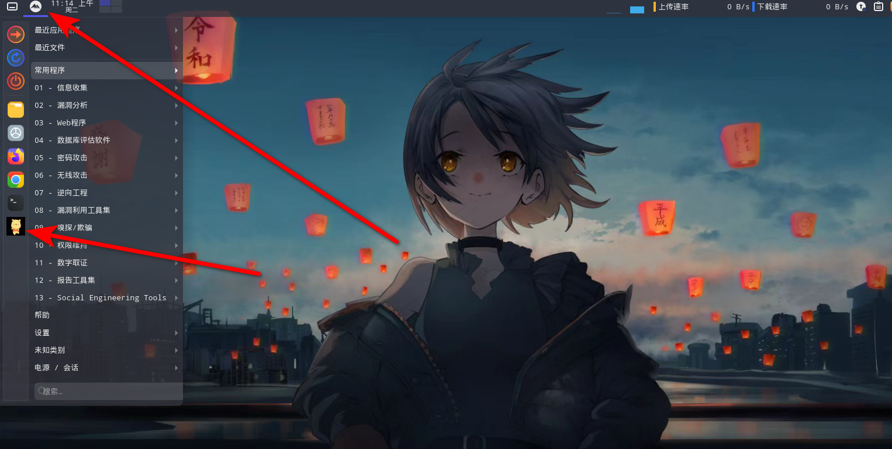

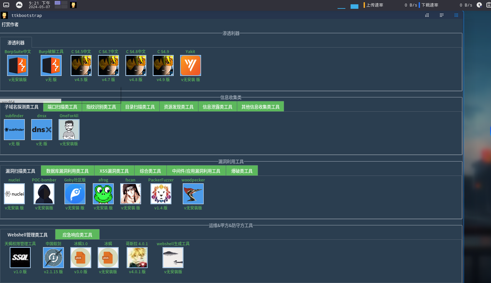

在这个版本里面我添加了自用的写的工具箱，一共集成了常见测试工具近60个，在kali 系统上没有的

- 神兵利器
  - **BurpSuite pro中文版**
  - **Cobalt Strike 4.5**
  - **Cobalt Strike 4.7**
  - **Cobalt Strike 4.8**
  - **Cobalt Strike 4.9**
  - **Yakit**

- 端口扫描工具
  - **naabu**：是用快速端口扫描工具

- 指纹识别工具
  - **CMSeek** （kali也集成了CMSeek是阉割版的）
  - **EHole**：EHole(棱洞) 重构版-红队重点攻击系统指纹探测工具
  - **CmsVulScan**：cms识别工具，用于识别网站使用的cms，收集了github上多个扫描工具的指纹

- 目录扫描工具
  - **dirsearch**（kali也集成了Dirsearch没有官方版本好用）：是一个基于python的命令行工具，用于暴力扫描页面结构，包括网页中的目录和文件，就是目录

- 资源发现工具
  - **Fofa_Viewer**：是一个用 JavaFX 编写的用户友好的 FOFA 客户端
  - **Fofax**：是一款使用Go编写的命令行FoFa查询工具

- 信息泄露工具
  - **Cloud_Bucket_Leak_Detection_Tools**（云存储泄露工具）：六大云存储，泄露利用检测工具
  - **SvnExploit**：支持SVN源代码泄露全版本Dump源码
  - **Dumpall**：是一款信息泄漏利用工具，适用于.git/.svn/.DS_Store泄漏和目录列出

- 子域名探测工具
  - **dnsx**：是一款功能强大的多用途DNS工具包，该工具运行速度非常快
  - **OneForAll**：是一款功能强大的子域收集工具
  - **subfinder**：是一个子域发现工具，可以为任何目标枚举海量的有效子域名

- 其他信息收集工具
  - **zpscan**：一款好用的命令行信息收集工具

- 漏洞扫描工具
  - **nuclei**：Nuclei使用零误报的定制模板向目标发送请求，同时可以对主机进行批量快速扫描
  - **POC-bomber**：是一款漏洞检测工具
  - **Goby**：是一款基于网络空间测绘技术的新一代网络安全工具
  - **afrog**：是一款快速稳定的高性能漏洞扫描程序
  - **fscan**：是一个内网综合扫描工具，方便一键自动化、全方位漏洞扫描
  - **Packer-Fuzzer**：一款针对Webpack等前端打包工具所构造的网站进行快速、高效安全检测的扫描工具
  - **woodpecker-framework**：是一款漏洞精准检测深度利用框架，只做一件事：精准狙击高危漏洞

- 数据库漏洞利用工具
  - **Sqlmap中文版**：汉化版sqlmap，对于英语不好的朋友们很友好
  - **MDUT**：MDUT工具全称 Multiple Database Utilization Tools， 是一款中文的数据库跨平台利用工具，集合了多种主流的数据库类型
  - **ARDM**：ARDM全称Another Redis Desktop Manager是一个更快、更好、更稳定的Redis桌面(GUI)管理客户端

- XSS漏洞工具
  - **XSS-Trike**：是一款检测Cross Site Scripting的高级检测工具
  - **DalFox**：DalFox是一个强大的开源工具，专注于自动化，非常适合快速扫描XSS缺陷和分析参数

- 综合工具
  - **Yasso**：是强大的内网渗透辅助工具集
  - **LiqunKit**：工具是一个综合漏洞扫描工具
  - **Full-Scanner**：是一个多功能扫描工具，支持被动/主动信息收集漏洞扫描工具联动，可导入POC和EXP

- 中间件/应用漏洞工具
  - **FastjsonScan**：Fastjson扫描器，可识别版本、依赖库、autoType状态等。
  - **WeblogicTool**：WeblogicGUI漏洞利用工具，支持漏洞检测、命令执行、内存马注入、密码解密等（深信服深蓝实验室天威战队强力驱动）
  - **Struts2漏洞检查工具**：Struts2工具是希潭实验室ABC123开发全版，Struts2本漏洞检测工具
  - **ShiroAttack2**：ShiroAttack2工具是一款针对Shiro560漏洞进行快速漏洞利用
  - **ShiroExp**：shiro一把梭工具
  - **MYExploit**：一款基于产品的一键扫描工具
  - **OA-EXPTOOL**：OA-EXPTOOL是OA综合利用工具，集合将近20款OA漏洞批量扫描
  - **通达OA漏洞利用工具（TongdaOATools）**
  - **Apt-t00ls**：高危漏洞利用工具 泛微|蓝凌|用友|万户|通达|中间件等
  - **综合利用工具**：ThinkPHP漏洞综合利用工具图形化界面，命令执行，一键getshell,批量检测，日志遍历，session包含,宝塔绕过
  - **利用工具By莲花**：漏洞利用工具，支持各版本TP漏洞检测，命令执行，getshell
  - **Jboss漏洞工具**：小黑开发的一款Jboss综合利用工具
  - **SBSCAN**：是一款专注于spring框架的渗透测试工具

- 暴力破解工具
  - **社工密码生成器**
  - **pydictor**：Pydictor是一个强大实用的黑客暴力破解字典建立工具

- webshell管理类工具
  - **天蝎权限管理工具（skyscorpion）**
  - **中国蚁剑**
  - **冰蝎3.0**
  - **冰蝎**
  - **哥斯拉 4.0.1**
  - **webshell生成工具（webshell_generate）**

- 应急响应工具
  - **BlueTeamTools分析辅助工具**

## 系统已经安装

- 搜狗输入法
- 谷歌浏览器
- 火狐浏览器
  - • HTTP Header Live：是一款可以帮助用户查看当前使用Chrome打开的所有网页的状态
  - • FoxyProxy：用的切换代理工具
  - • Video DownloadHelper ：提取网页视频
  - • Disable javascript 禁止js

- neofetch
- lolcat
- 文泉驿-微米黑
- 文泉驿-正黑
- 文泉驿-点阵宋体
- 图标：Qigir-ubuntu-darkReversal 小米
- Plasma样式：Layn
- 光标：Layan
- 安装登录管理器：sddm
- 欢迎界面：AnimatedAbstract_bku9
- 登录屏幕：Slice
- utools（已经安装没有启动，会影响虚拟机性能）
- latte-dock（已经安装没有启动，会影响虚拟机性能）
- fzf
- ranger
- subfinder
- dnsx

## 增加好用功能

我这个基于工具写了一些好用功能

### 终端搜索功能

这个是基于fzf工具

比如我们在终端搜索之前用过的命令

我们按`ctrl+r` 搜索历史命令

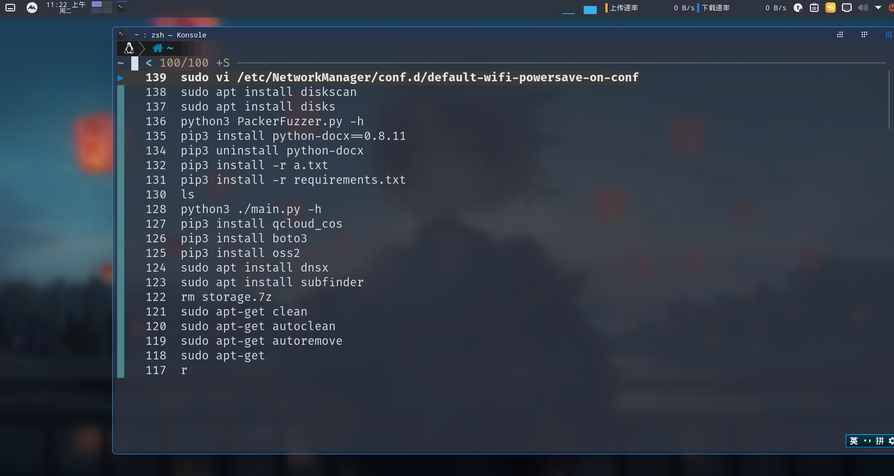

比如我们pip命令后面忘了是什么了，我们就可以输入pip然后在按`ctrl+r`

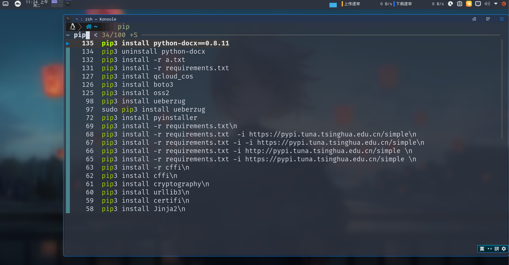

### 终端文件管理器

这个功能是ranger工具

在终端输入r

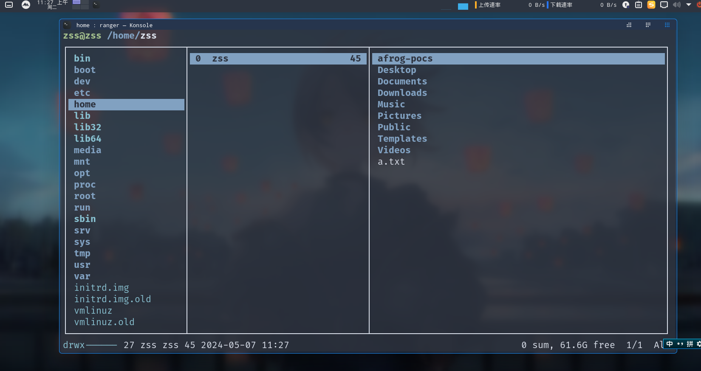

## 下载使用说明

关注“W啥都学“公众号回复kde2获取下载链接

我一共打包了2个版本

### 完整版

>系统压缩大小：18.8 GB
>
>解出来：36.00GB 左右

这个版本是叫全部工具集成上去了，优点打开即可使用，缺点下载文件会很大

### 系统版

> 系统压缩大小：4.91 GB
>
> 解出来：20.00GB 左右

这个版本没有叫工具放上去，安装了工具框架，优点下载文件小，缺点需要自己下载导入工具

下载导入方法

1. 全部工具导入

   全部工具导入，下载文件名叫`storage.7z`，然后放到用户目录（/home/zss）下面解压即可图

   `storage.7z`大概3GB左右

   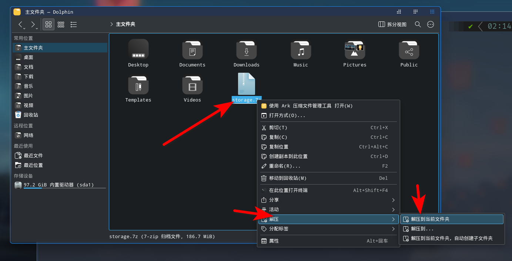

   导入完成，全部功能都可以使用了

2. 单个工具导入

   单个工具导入，下载自己想用的工具导入，比如下载`jdk-20.0.1.zip`，然后放到用户目录（`/home/zss`）下面解压即可图

   注意：java环境启动的要先下载解压java 20和java 8

   > java 20 下载地址：https://pan.quark.cn/s/4c2708e908ac 提取码：ms3Y，
   > java 8 下载地址：https://pan.quark.cn/s/e7e431924e27 提取码：hpmT

   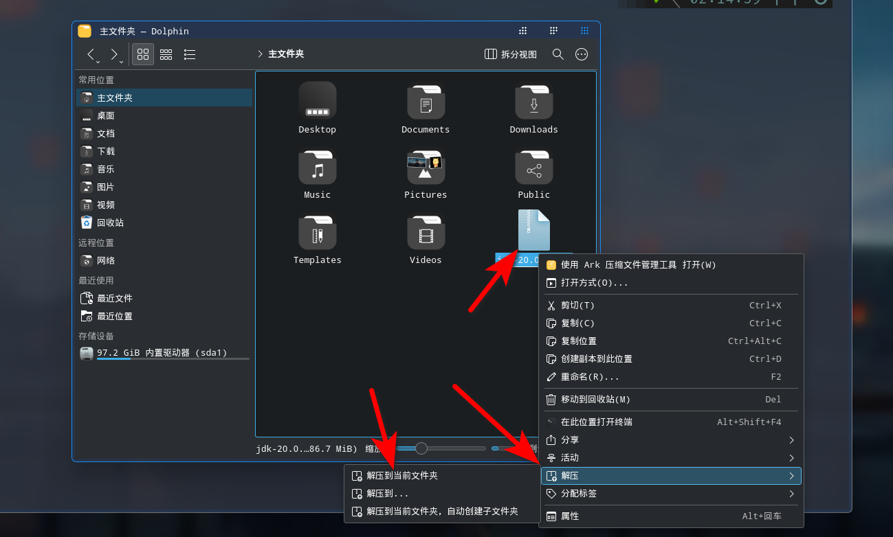

   导入什么工具就可以用什么工具
